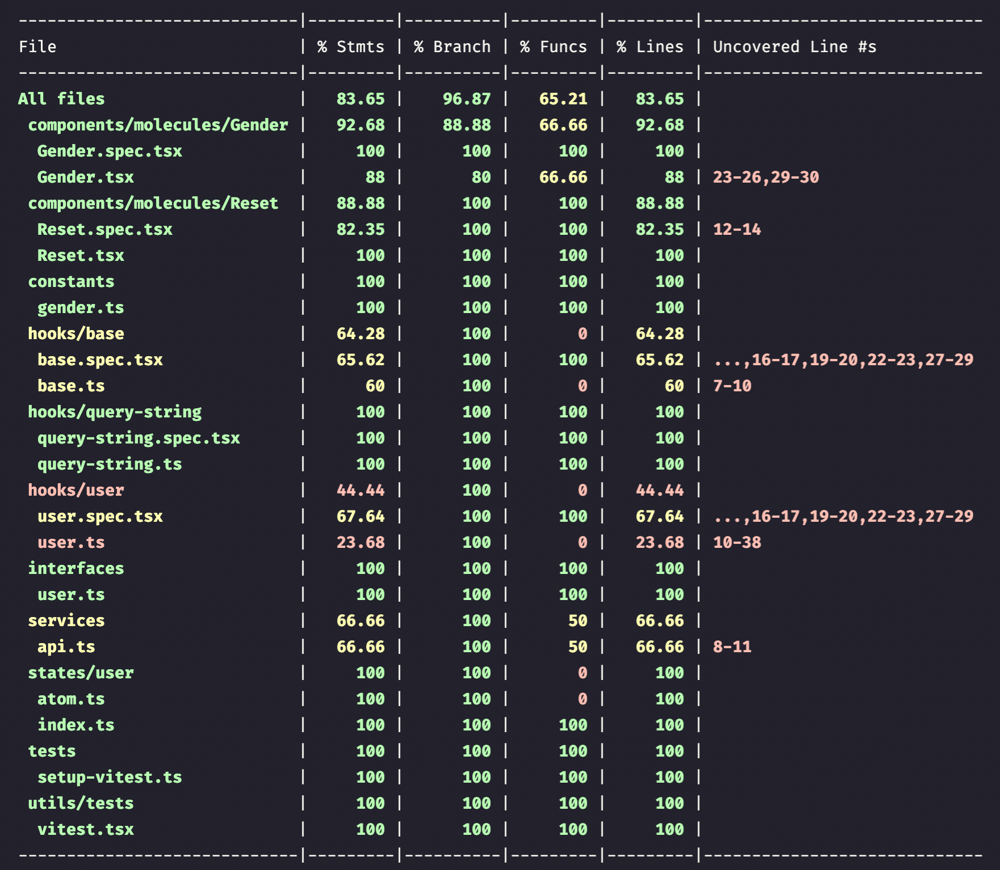
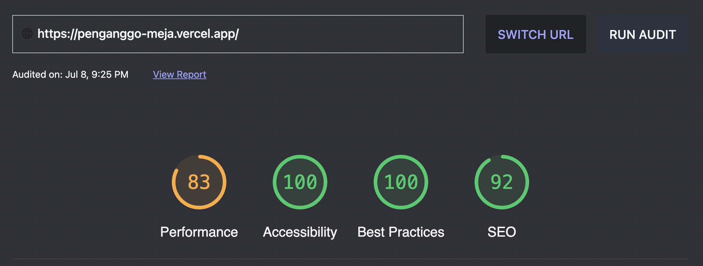

# Panganggo Meja

> React app demo for displaying table with filter, sort and search

## Table of Contents

- [Getting Started](#getting-started)
- [Technology](#technology)
- [Test Result](#test-result)
- [Performance](#performance)

## Getting Started

```sh
# Install dependencies
yarn

# Run dev server
yarn dev

# Build for production
yarn build

# Spin up server to run production build
yarn preview

# Run test case
yarn test

# Run test case with coverage
yarn coverage
```

## Technology

- [TypeScript](https://www.typescriptlang.org/)
- [Vite](https://vitejs.dev/)
- [Recoil](https://recoiljs.org/)
- [SWR](https://swr.vercel.app/)
- [Vitest](https://vitest.dev/)
- [React Testing Library](https://testing-library.com/)
- [Material UI](https://mui.com/)
- [React Data Table](https://react-data-table-component.netlify.app/)

## Test Result

Unit test result as of 8 July 2022:



## Performance

Performance as of 8 July 2022:


